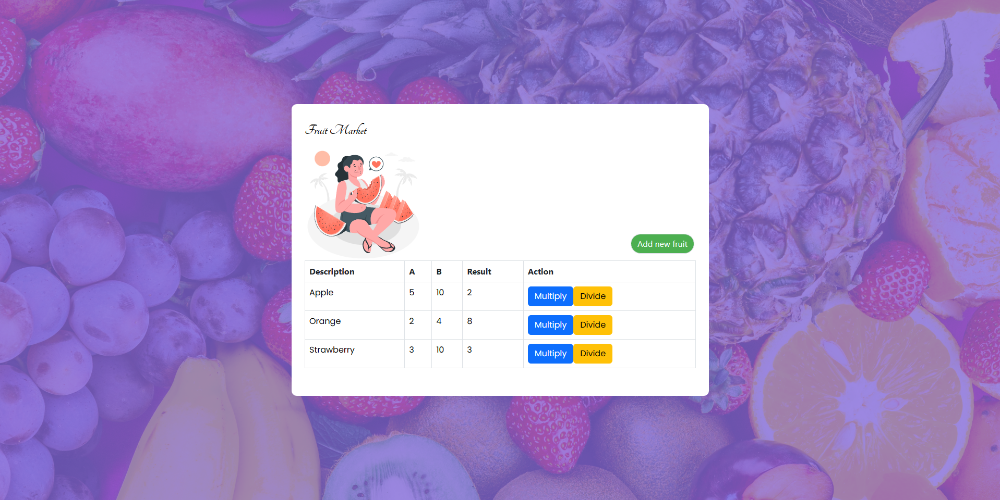

<p align="center">

</p>
<h1 align="center"> Fruit Market </h1>
<p align="center">
  <a href="#-tecnologias">Tecnologias</a>&nbsp;&nbsp;&nbsp;|&nbsp;&nbsp;&nbsp;
  <a href="#-projeto">Projeto</a>&nbsp;&nbsp;&nbsp;|&nbsp;&nbsp;&nbsp;
  <a href="#%EF%B8%8F-como-executar">Como executar?</a>&nbsp;&nbsp;&nbsp;|&nbsp;&nbsp;&nbsp;
  <a href="#-mostre-seu-suporte">Suporte</a>
</p>

<p align="center">
    
</p>

## 🧑‍💻 Tecnologias
* **Backend**
  * C#
  * .NET
  * SQL Server
  * Entity Framework 
* **Frontend**
  * React
  * Reactstrap
  * Bootstrap

## 💻 Projeto
O Fruit Market é um projeto de gerenciamento de frutas onde é possível cadastrar uma lista de frutas, 
exibir a lista completa de frutas, fazer as operações de multiplicação e divisão. 
Para conseguir efetuar as operações de multiplicação e divisão basta criar uma fruta primeiramente pela opção **Add new Fruit**.
Esse projeto é divido em backend, composto por uma API desenvolvida em C# e .NET Core, e frontend em React utilizando JavaScript com Vite.

## ⚛️ Como executar?
Primeiramente, é essencial deixar a **API** executando em segundo plano. Para isso, antes deve-se configurar o banco de dados com o seu servidor 
e alterar a connection string no arquivo appsettings.json:
```
"ConnectionStrings": {
  "FruitMarket": "server=nomeDoSeuServidor; Database=FruitMarketDb; Integrated Security=True; trustServerCertificate=true"
}
```
Feito isso, rodamos o frontend em FruitMarket.Client instalando as dependências necessárias e depois executando o cliente que vai consumir a API:

- Instalar as dependendências:
```
cd FruitMarket.Client
yarn
```

- Executar o client que vai consumir a API:
```
yarn dev
```
Pronto, só acessar o localhost e a porta designada, com a API que fornece o backend rodando, que a aplicação estará rodando!

<hr />

## ✨ Mostre seu suporte!
Dê uma ⭐️ se esse projeto te inspirou de alguma forma!<br />
Entre em contato comigo: <a href="https://www.linkedin.com/in/marioalvesneto/">LinkedIn</a>
Feito com 💜 por Mario Alves.
